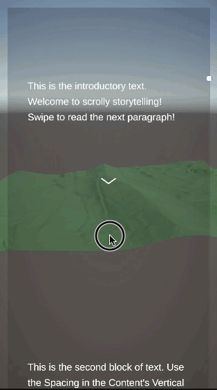

# ScrollyTelling
 A sample project that uses vertical scrolling to show text, and advance a timeline. This is to create a Scrollytelling effect to explain a story with text and animation similar to what the NY Times did for this [Antartica](https://www.nytimes.com/interactive/2021/12/13/climate/antarctic-climate-change.html) article.
 
 The project uses a Timeline and a vertical scrollview as a playhead to scrub through the Timeline. The Playable Director component on the camera has Play On Awake set to false, and Wrapmode set to Hold. A script is attached to the scrollview to advance the timeline from beginning to end. Using a scrollview works well because it has an inertia setting and can easily move forward and back along the Timeline.
 
 The Timeline itself has a Cinemachine track to move between cameras, an animation track and a few different events as an example of how this might be used.
